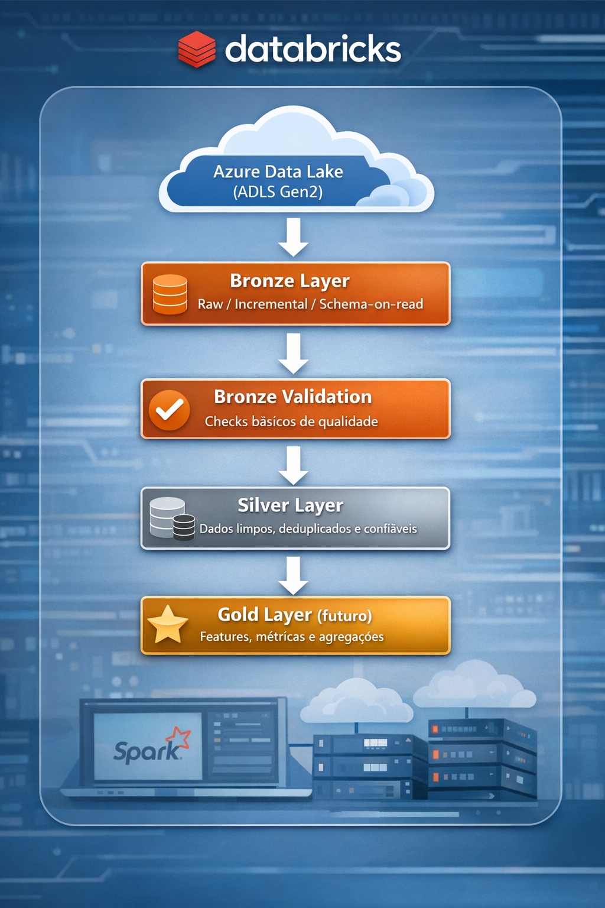

# BikeStore Lakehouse – Data Foundation

Este projeto implementa um **Data Lakehouse** para o domínio **BikeStore**, com foco em **qualidade, rastreabilidade e escalabilidade**, servindo como **base para criação de variáveis, análises e produtos analíticos**.

A arquitetura segue o padrão **Medallion (Bronze → Silver → Gold)**, com ingestão estruturada, validações e transformações orientadas a domínio.

---

## Objetivo do Projeto

* Centralizar dados operacionais do BikeStore em um **Lakehouse**
* Garantir **dados confiáveis (trusted data)** na camada Silver
* Preparar a base para:

  * criação de **Book de Variáveis**
  * análises analíticas
  * produtos de dados
  * futuros modelos de ML

Este projeto foi desenhado como um **produto de dados de escopo fechado**, com entidades bem definidas e pipelines explícitos.

---

## Arquitetura Geral




Tecnologias:

* **Databricks**
* **Apache Spark**
* **Delta Lake**
* **Azure Data Lake Storage Gen2**
* **Databricks Jobs (YAML)**

---

## Estrutura do Repositório

```
data-lake-databricks/
├── README.md
├── src/
│   ├── config/
│   │   └── 01.settings.py              # Load env vars, layer paths
│   ├── common/
│   │   └── utils.py                 # Helpers: logging, Spark utils
│   ├── bronze/
│   │   ├── ingest.py          # Raw load, add metadata
│   │   └── upload.py                # Write to Delta bronze tables
│   ├── silver/
│   │   ├── base.py
│   │   ├── registry.py
│   │   ├── categories.py
│   │   ├── customers.py
│   │   ├── order_items.py
│   │   ├── orders.py
│   │   ├── products.py
│   │   ├── brands.py 
│   │   ├── staffs.py
│   │   ├── stores.py
│   │   └── stocks.py
│   ├── gold/
│   │   ├── treat.py                 # Aggregate business logic
│   │   └── upload.py                # Write gold tables
├── notebooks/                       # Optional: interactive testing
│   ├── 00_setup/
│   │   └── 00_infrastructure.ipynb  # Write to Delta bronze 00_infrastructure
│   ├── 01_bronze/
│   │   ├── 01_bronze_pipeline.ipynb  
│   │   └── 02_validation_bronze.ipynb  # Data quality checks
│   ├── 02_silver/
│   │   └── 01_silver_pipeline.ipynb  
│   └── 03_gold/
│       └── 
├── resources/                       # Databricks Jobs JSON defs 
│   └── jobs/
│       └── bikestore_lakehouse.yml
├── tests/                           # Pytest for src modules
└── data/                            # Samples for local dev


```

---

## Bronze Layer – Ingestão

### Descrição

A camada Bronze é responsável por:

* ingerir dados brutos (JSON)
* preservar o formato original
* garantir rastreabilidade
* armazenar dados em **Delta Lake**

Cada tabela é ingerida de forma **independente**, via parâmetro `table_name`.

### Tabelas Bronze

* brands
* categories
* customers
* order_items
* orders
* products
* staffs
* stocks
* stores

### Execução

Notebook:

```
notebooks/01_bronze/01_bronze_pipeline
```

Parâmetro:

```json
{
  "table_name": "customers"
}
```

---

## Validação Bronze

Após a ingestão, um job de validação executa verificações básicas, como:

* existência de dados
* leitura das tabelas Delta
* consistência mínima de schemas

Notebook:

```
notebooks/01_bronze/02_validation_bronze
```

---

## Silver Layer – Dados Confiáveis (Trusted)

### Princípios da Silver

A camada Silver segue os princípios de **Trusted Data**:

* limpeza de dados
* remoção de registros inválidos
* padronização de schemas
* deduplicação
* inclusão de metadados de ingestão

Cada tabela Bronze gera **uma tabela Silver correspondente**.

---

### Padrão de Implementação

* **Regras genéricas** ficam em `silver/base.py`
* **Regras específicas** por entidade ficam em arquivos dedicados

Exemplo:

```
src/silver/customers.py
```

Funções comuns:

* `read_bronze`
* `add_ingestion_columns`
* `write_silver`

---

### Colunas de Metadados

Todas as tabelas Silver possuem:

| Coluna       | Descrição                       |
| ------------ | ------------------------------- |
| ingestion_ts | Timestamp da ingestão na Silver |

Essas colunas permitem:

* auditoria
* troubleshooting
* rastreabilidade

---

## Orquestração (Databricks Jobs)

O pipeline é orquestrado via **Databricks Jobs (YAML)**, com:

* uma task por tabela
* dependências explícitas
* separação clara entre Bronze e Silver

Fluxo:

1. Ingestão Bronze (paralela)
2. Validação Bronze
3. Transformação Silver (paralela)

---

## Estratégia de Escopo

Este projeto foi desenhado como:

> **Produto de dados de escopo fechado**

Isso significa:

* entidades bem definidas
* pipelines explícitos
* menor complexidade operacional
* maior previsibilidade de custo

Caso o escopo evolua, o desenho permite:

* inclusão de novas entidades
* expansão para camada Gold
* criação de Feature Store

---

## Próximos Passos

* Implementação da camada **Gold**
* Criação do **Book de Variáveis**
* Métricas de qualidade avançadas
* Monitoramento e alertas


